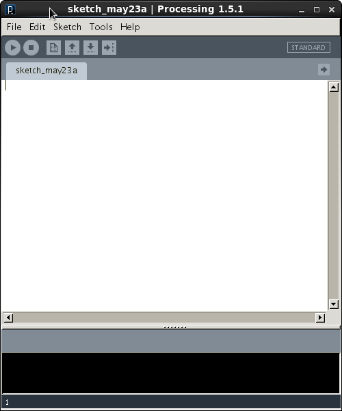

Manitoba High School Computer Science Day
-----------------------------------------
The Manitoba High School Computer Science Day will be held on Friday, May 23, 2014 in the Department of Computer Science at the University of Manitoba.

You can find more information about Manitoba High School Computer Science Day on the University of Manitoba Department of Computer Science web site: http://www.cs.umanitoba.ca/highschool/

Processing Tutorial
===================

[Processing](http://processing.org/) is a [Domain-Specific Language](http://en.wikipedia.org/wiki/Domain_specific_language) (DSL) for visualization built on top of the [Java programming-language](http://java.oracle.com/). That means that if you already know Java, or another C-like language, then you already know how to use the most basic functionality of Processing.

The Processing Environment
==========================

You can use any text-editor to write a Processing program, but the recommended way to write a Processing language is using the Sketchbook environment:



Using the sketchbook is easy:

1. You write your Processing program in the text-editor area.
2. You click on the Play button ().

Writing a Processing Program
============================
Processing is built on top of Java, but does not require you to write a `class`, or a `main` method. Instead, Processing works by calling methods with certain names:

1. The `setup` method is called once, when the program starts.
2. The `draw` method is called constantly, each time the window is re-drawn.
3. The `keyPress` method is called whenever a key on the keyboard is pressed.
4. The `mousePressed` method is called whenever the mouse is clicked.

### Setup

Start by opening the sketchbook and writing a method called `setup` with a `void` return type and no parameters:

```java
void setup() {

}
```
If you press the play button, you should see a very small window appear. You can make the window bigger by calling the `size` method. The `size` method takes two arguments, a width and a height:

```java
void setup() {
    size(600, 600);
}
```
Still not very interesting. We can change the background colour of the window by calling the `background` method. The `background` method takes one argument, an `int` between 0 and 255, representing the RGB colour that it should use to colour the background:

```java
void setup() {
    size(600, 600);
    background(50); // a nice, dark, grey colour.
}
```

*Still* not very interesting. Lets start doing some animation.

### Draw
The `draw` method is called every time the window is repainted. Processing constantly calls this method in an *infinite loop*:

```java
void setup() {
    size(600, 600);
    background(50); // a nice, dark, grey colour.
}

void draw() {

}
```

Let's draw a rectangle by calling the `rect` method. The `rect` method takes four arguments, an `x` and `y` coordinate and a `width` and `height` of the rectangle:

```java
void draw() {
    rect(300, 300, 100, 100); // draw a 100x100 square, in the center of the window
}
```

You can change the colour of the rectangle by calling the `fill` method before calling `rect`:

```java
void draw() {
    fill(47, 255, 50); // a nice, bright, green square
    rect(300, 300, 100, 100);
}
```

**STILL** not very interesting -- the square doesn't even move! We can make the square move by keeping a *global counter*, and using the counter as the `x` or `y` coordinate of the rectangle:

```java
float x = 0;

// ... setup ...

void draw() {
   x++;
   fill(47, 255, 50); // a nice, bright, green square
   rect(x, 300, 100, 100);
}
```

The square slides across the screen! You might notice that the square is leaving a trail as it moves across the screen (kind of like a slug). That trail is the border of the old position of the square not getting cleared every time the `draw` method is called. You can clear the window every time the draw method is called by moving the call to the `background` method into the `draw` method:

```java
float x = 0;

void setup() {
    size(600, 600);
}

void draw() {
    background(50);
    x++;
    fill(47, 255, 50);
    rect(x, 300, 100, 100);
}
```

Much nicer.

### Useful Methods
Processing has a variety of methods that you can call from any of the methods in the sketchpad. Here is a limited selection of the useful methods that you can call in the draw method:

* `println`: prints messages to the console, just below the text-editor in the sketchpad.
* `stroke`: changes the colour of a point, and the line colour of shapes. Example: `stroke(47, 47, 47);`
* `point`: draws a single pixel on the window at an `x` and `y` coordinate. Example: `point(300, 300);
* `text`: draws text onto the window, takes a `String` and an `x` and `y` coordinate as arguments. Example: `text("Hello, world!", 300, 300);`
* `random`: generates random numbers between 0 and the float argument. Example: `random(150);` generates numbers between 0 and 150.
* `ellipse`: draws an ellipse (or a circle) at an `x` and `y` coordinate with a `width` and `height`. Example: `ellipse(300, 300, 50, 50);`.
* `loadImage`: loads an image from the hard-drive or from the internet.
* `image`: draws an image (loaded with `loadImage`) on the window at an `x` and `y` coordinate with a `width` and `height`. Example: `image(loadedImage, 300, 300, 50, 50);`.
* `translate`: shifts an image by `x` and `y` units. Example `translate(100, 100);` moves a drawn item down 100 pixels and right 100 pixels.
* `millis`: the current time in milliseconds.
* `rotateX` and `rotateY`: rotates an image by a number of `radians`. Example: `rotateX(millis() / 10);`
* `radians`: converts degrees to radians.
* `box`: draws a cube (note: requires calling size with the `P3D` option: `size(600, 600, P3D)`.

### Useful Variables
Processing also sets certain global variables for you to use within the draw method:

* `mouseX`: the `x` coordinate of the mouse on the window.
* `mouseY`: the `y` coordinate of the mouse on the window.

Example Exercises
=================
You can find some example exercises at the links below. The examples are `pde` files (plain-text) that you can open with the Processing sketchbook (or any text editor).

* [Boo Follow](boo_follow): A little game where boo follows your mouse around.
* [Craxy Boxes](crazy_boxes): Drawing and translating cubes.
* [Pointillism](pointillism): Loading of images and re-drawing them with ellipses (sort of like [pointillism](http://en.wikipedia.org/wiki/Pointillism) by Georges Seurat).
* [Polar Coordinates](polar_coordinates): Drawing a polar rose with the `point` method.
* [Pulse Cube](pulse_cube): A cube that pulses in-and-out and follows your cursor.
* [Floppy Bird](floppy_bird): A primitive clone of Flappy Bird.

Additional Resources
====================
The Processing environment is supported by a huge community of people. You can find many resources on the freely available on the web for learning Processing:

* http://processing.org/ The Processing website.
    * http://processing.org/reference/ The Processing reference guide.
* http://openprocessing.org/ An online repository of high-quality Processing examples

You can also find a many examples built-into the Processing sketchpad by clicking on **File** > **Examples...**.
